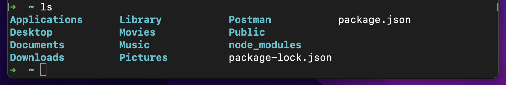
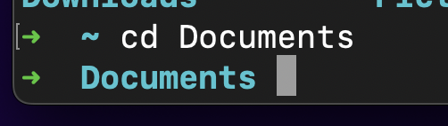

# Primary terminal commands

## ls

- This command displays a list of the current **visible** files in the current directory. The reason I say visible is because some files are hidden but we can display them as well if we instead use the command **ls -a**.

- Another trick with the **ls** command is using **ls -l** which displays the files in great detail. It shows their permissions, date made and other information. 

- The final thing we learnt about ls today is that you can combine the 2 tricks mentioned above to make **ls -al**. This as suggested will display all files with great detail.

## pwd

pwd simply stands for print working directory and as it says, it displays the route to the current directory.

## cd

This command stands for change directory. It is normally used in combination with a directory route relative to the current directory to change to that new directory.

For instance the following pictures will display an example:

The first picture shows the current directory whilst the second picture shows how cd Documents changed the current directory to the Documents one.

There is also another way of using **cd**. If you use cd by itself then it will simply change the directory to the home directory.

## .

**.** simply means current directory and can be used in other commands

## ..

This one is the same as above except it instead means parent directory.

## mkdir

- **mkdir** stands for make directory and is used with a following argument which represents the name of the directory that will be made.

- For example **mkdir new_folder** would create a new directory called new_folder inside the current directory.

## touch

- **touch** is used to create new files. This is done by using a following argument that represents the name and type of file. 

- For example: **touch new_file.txt** would create a text file called new_file whereas **touch new_file.md** would create a md file instead.
open

## mv

- This command moves a file or directory and can also be used to rename it. This command takes 2 arguments after and depending on the 2nd argument, will either move or rename the file/directory that was used as the first argument.

- for example: **mv new_file.txt old_file.txt** would rename the text file new_file to old_file whereas **mv new_file.txt crocodile** would move the file to the directory called **crocodile**.

## rm

- the **rm** command removes files or directories. It takes as argument the name of what you want removed. However once, something is removed using this mehtod, it cannot be returned. 

- Since some directories may contain multiple elements, **rm -r** is used where the r means repeat. This is used to repeatedly remove all elements within that directory.

- Finally some files may be important and so a message may be sent to confirm that you want to delete it and so **rm-rf** is used to skip this message and delete it regardless of the importance.

## history

Very simple command that shows history of commands used. 

## shortcuts
- An alterantive to history is using the up and down keys instead to see recent commands where up key will show previous command and down can be used for the next command. Almost like a scroll wheel.

- The tab key can be used to auto complete whilst writing commands in the terminal.

# git commands
